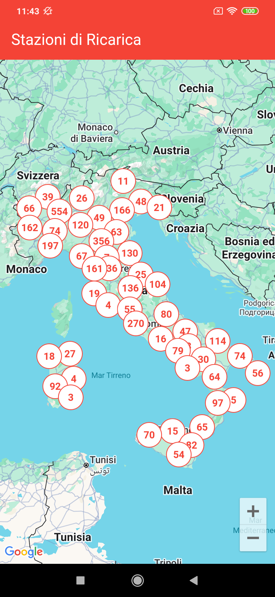

# Charging Stations Map - README

**Autore:** Giuseppe Conticchio  
**Data:** Gennaio 2026  
**Progetto:** Visualizzazione stazioni di ricarica Enel X con clustering su Google Maps

---

## Panoramica

In questo progetto ho sviluppato un'app Flutter per visualizzare le stazioni di ricarica Enel X in Italia, con clustering ottimizzato su Google Maps.  
L’obiettivo principale è stato **massimizzare le performance**, garantire una **UX fluida** ma **minimale**, e rendere il codice **pulito e manutenibile**.

---

## Analisi Chiamata API

Perchè ho scelto di usare **OpenChargeMap** invece dell’API pubblica di Enel:

1. OpenChargeMap fornisce **tutte le posizioni GPS delle stazioni** in formato JSON senza autenticazione complicata (api key generata dal loro sito con una semplice autenticazione e gratuita).
2. L’API Enel pubblica **non espone facilmente tutte le coordinate** delle stazioni tramite endpoint ufficiale (come mostrato nella mappa Enel X nella loro pagina web: https://www.enel.com/it/azienda/mobilita/mappa-stazioni-ricarica).
3. OpenChargeMap permette di filtrare per **operatore** (l’OperatorID 80 corrisponde a Enel X perché è definito nell’endpoint ufficiale referencedata di OpenChargeMap, che contiene la lista completa degli operatori con i relativi ID: https://api.openchargemap.io/v3/referencedata/), **paese e numero massimo di risultati**, semplificando il caricamento e il clustering.

> Nota: questa scelta mi ha permesso di concentrarmi sull’ottimizzazione dei marker e del clustering piuttosto che sull’estrazione dei dati da API proprietarie (Enel).

---

## Ottimizzazioni Effettuate

### 1. Debouncing camera movement

Ho implementato un **debounce di 200ms** per ridurre il numero di aggiornamenti dei marker durante lo scroll (inteso come zoom o spostamennto) della mappa, di modo che ci siano meno chiamate al marker manager, scorrimento più fluido e minor consumo di CPU e batteria.

### 2. Marker caricati solo nei bounds visibili

Invece di caricare tutte le stazioni d’Italia ogni volta, calcolo i **bounds visibili** della mappa e aggiorno solo i marker che rientrano nel bound, in modo da avere un caricamento più veloce e ottimizzando la memoria, specialmente se ci sono di stazioni coe nel nostro caso.

### 3. Cache delle icone dei cluster

Le icone dei cluster vengono **generate una sola volta e salvate in cache**, evitando di rigenerarle ogni volta che lo zoom cambia.

### 4. Parsing JSON centralizzato

Ho usato **factory methods nel modello ChargingStation** per gestire tutto il parsing JSON. codice più chiaro, facile da mantenere e meno overhead cognitivo per eventuali aggiornamenti futuri all'API.

### 5. Stati reattivi con GetX

Ho reso **isLoading, markers e errorMessage osservabili** con GetX, così la UI si aggiorna automaticamente al cambiamento dello stato.

### 6. Sicurezza API key

La chiave per **OpenChargeMap** è letta dal file `.env`, evitando di hardcodarla nel codice, per maggiore sicurezza.

### 7. Ottimizzazioni grafiche e UX

- Anchor corretto per cluster e marker singoli
- Formato “999+” per cluster che contengono tanti marker
- Info window con titolo e indirizzo completo della stazione di ricarica

---

## Architettura del codice

- **Repository pattern** per separare data access e logica di business
- **MarkerManager** per gestire clustering, aggiornamenti bounds e rendering marker
- **GetX** per stati osservabili e reattivi
- **Fluster** per clustering ottimizzato fino a zoom 17 con radius configurabile

---

## Sviluppi Futuri

Nei prossimi aggiornamenti si potrebbe implementare:

1. **Traduzioni**: supporto multilingua per UI e info window
2. **Marker personalizzati**: icone diverse per tipo di stazione o livello di disponibilità o marker con stiler specifico per i cluster
3. **Pagine aggiuntive**: login, account settings e preferenze utente
4. **Filtri avanzati**: permettere all’utente di selezionare altri tipi di stazioni di ricarica, non solo Enel X, e magari anche di filtrarle con una barra di ricerca per indirizzo o nome

---

## Conclusione

Ho sviluppato un sistema di clustering **performante e scalabile**, con UI reattiva e ottimizzazioni di rendering avanzate.  
Il progetto può essere **estendibile**, in futuro con supporto per multilingua, personalizzazione dei marker e preferenze utente.

**Tempo di lavoro**: 20 ore (8 analisi, 12 implementazione, 4 pulizia codice e documetazione)
